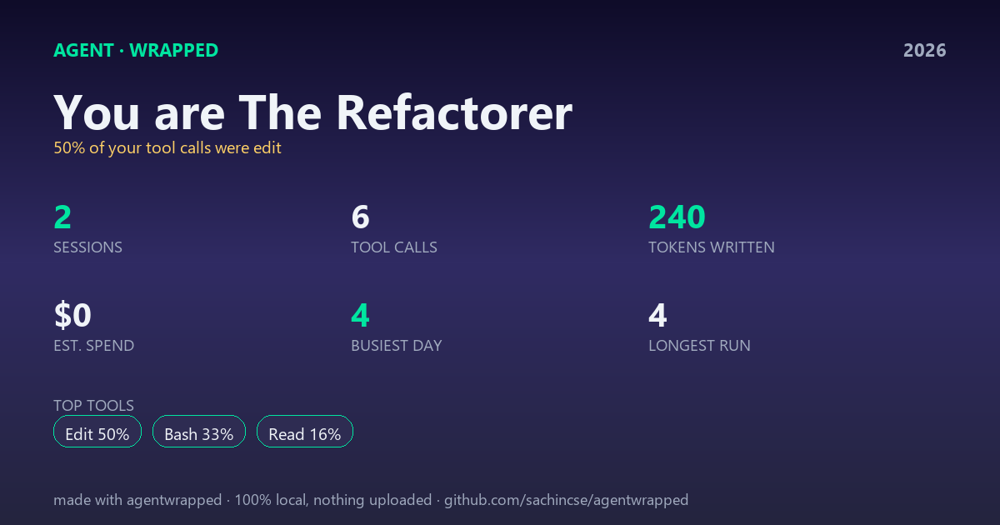

<div align="center">

# agentwrapped

### Spotify Wrapped, but for your AI coding agent.

**One command turns the session logs your coding agent already wrote into a single shareable card: your tool-call personality, total spend, busiest day, and the year in numbers. 100% local — nothing is ever uploaded.**

[](https://github.com/sachincse/agentwrapped/actions/workflows/ci.yml)
[](https://pypi.org/project/agentwrapped/)
[](LICENSE)



</div>

---

```bash
pipx install agentwrapped     # or: pip install agentwrapped
agentwrapped                  # writes agent-wrapped.png from all your local sessions
```

That's it. No login, no API key, no config. It reads the `.jsonl` logs Claude Code already keeps on disk and renders one card you can drop straight into a tweet.

## Usage

```bash
agentwrapped                  # all-time card (PNG)
agentwrapped --year 2026      # just this year
agentwrapped --project        # only the current project, not your whole machine
agentwrapped --terminal       # print it in the terminal instead of a PNG
agentwrapped -o me.png        # choose the output path
```

### Your agent personality

agentwrapped reads which tools dominate your sessions and gives you a title:

| If most of your calls are… | You are… |
|---|---|
| `Edit` / `MultiEdit` | **The Refactorer** |
| `Write` | **The Builder** |
| `Bash` | **The Operator** |
| `Read` / `Grep` / `Glob` | **The Explorer** |
| `WebSearch` / `WebFetch` | **The Researcher** |
| `TodoWrite` / `Task` | **The Planner** |
| a balanced mix | **The Generalist** |

## What's on the card

Sessions · tool calls · tokens written · estimated spend · busiest day · longest run · your top tools — and your personality. All computed locally; no file names, prompts, or code ever appear on the card or leave your machine.

## Privacy

agentwrapped makes **zero network calls**. It reads only structural data (tool names, counts, token totals, timestamps) and renders an image on your disk. The card is yours to share — or not.

## How it works

agentwrapped is the playful sibling of **[trace-lens](https://github.com/sachincse/trace-lens)** and reuses its battle-tested JSONL parser, so there's exactly one log reader to trust. Liked your Wrapped? **trace-lens** is the serious version — it scores each session for cost, loops, and wasted tool calls, and can gate your agent in CI.

## Costs are estimates

Spend is computed from trace-lens's configurable price table and may lag real pricing. Set `TRACE_LENS_PRICES` to a JSON file with current numbers to make it exact.

## Development

```bash
# trace-lens is the one dependency; install it first if not on PyPI yet:
pip install git+https://github.com/sachincse/trace-lens
git clone https://github.com/sachincse/agentwrapped && cd agentwrapped
pip install -e ".[dev]"
pytest -q
python scripts/gen_demo_card.py   # regenerate docs/card.png from the test fixtures
```

## License

MIT © Sachin Singh
